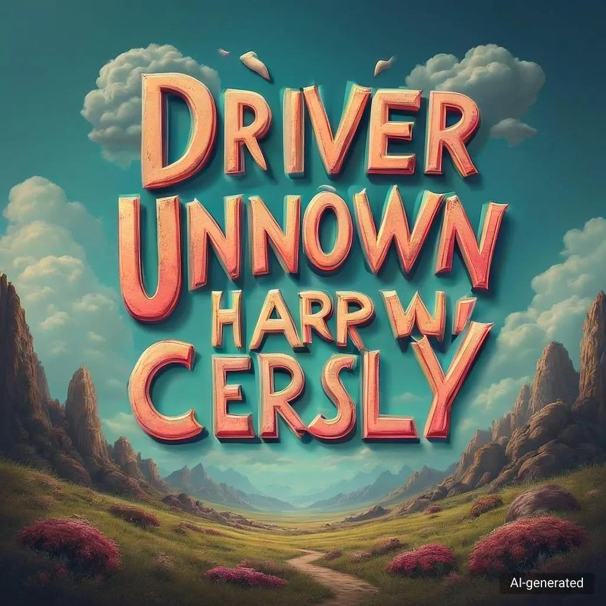
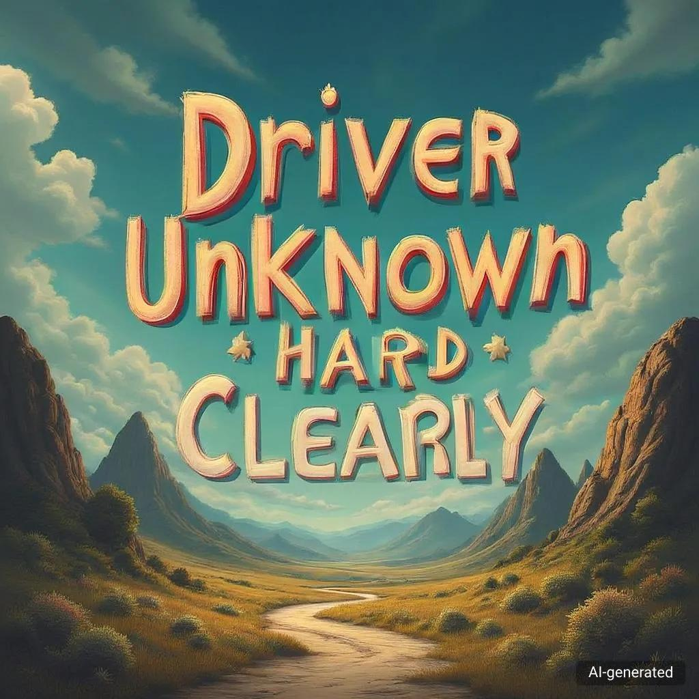
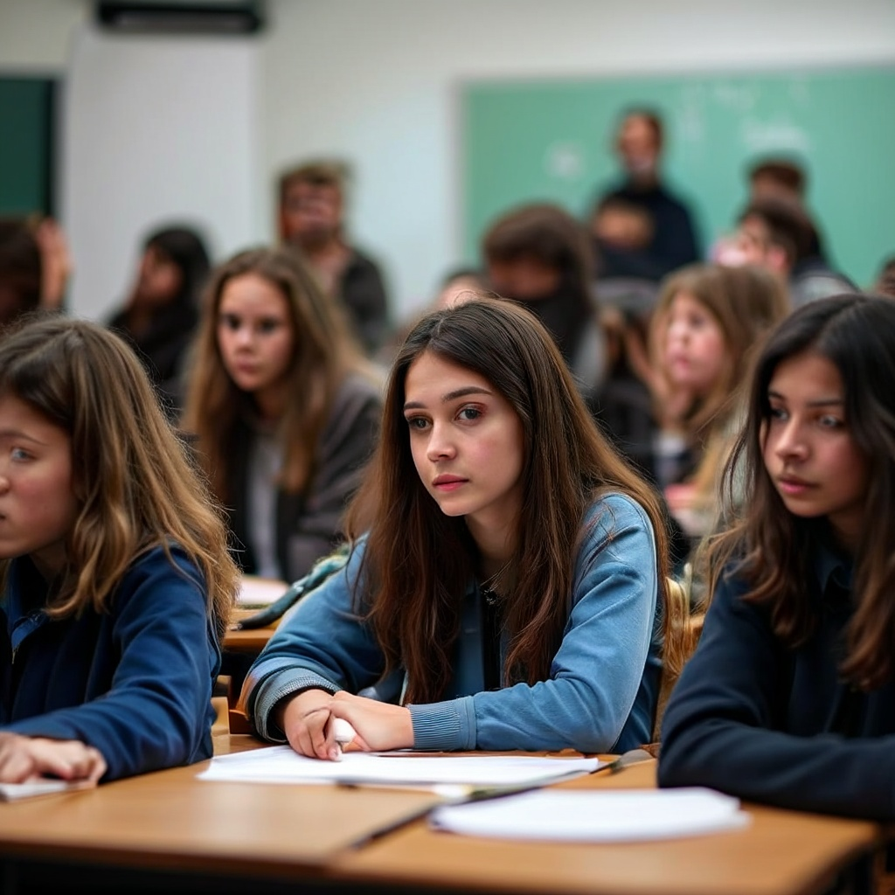

# Infinity $\infty$: Scaling Bitwise AutoRegressive Modeling for High-Resolution Image Synthesis

<div align="center">

[](https://opensource.bytedance.com/gmpt/t2i/invite)&nbsp;
[](https://foundationvision.github.io/infinity.project/)&nbsp;
[](https://arxiv.org/abs/2412.04431)&nbsp;
[](https://huggingface.co/FoundationVision/infinity)&nbsp;
[](https://github.com/FoundationVision/Infinity)&nbsp;
[](https://replicate.com/chenxwh/infinity)&nbsp;

</div>
<p align="center" style="font-size: larger;">
  <a href="https://arxiv.org/abs/2412.04431">Infinity: Scaling Bitwise AutoRegressive Modeling for High-Resolution Image Synthesis</a>
</p>


<p align="center">

<p>

## 🔥 Updates!!
* Dec 24, 2024: 🔥 Training and Testing Codes && Checkpoints && Demo released!
* Dec 12, 2024: 💻 Add Project Page
* Dec 5, 2024: 🤗 Paper release

## 🕹️ Try and Play with Infinity!

We provide a [demo website](https://opensource.bytedance.com/gmpt/t2i/invite) for you to play with Infinity and generate images interactively. Enjoy the fun of bitwise autoregressive modeling!

We also provide [interactive_infer.ipynb](tools/interactive_infer.ipynb) for you to see more technical details about Infinity.

## 📑 Open-Source Plan
  - [ ] Infinity-20B Checkpoints
  - [x] Training Code 
  - [x] Web Demo 
  - [x] Inference Code
  - [x] Infinity-2B Checkpoints
  - [x] Visual Tokenizer Checkpoints


## 📖 Introduction
We present Infinity, a Bitwise Visual AutoRegressive Modeling capable of generating high-resolution and photorealistic images. Infinity redefines visual autoregressive model under a bitwise token prediction framework with an infinite-vocabulary tokenizer & classifier and bitwise self-correction. Theoretically scaling the tokenizer vocabulary size to infinity and concurrently scaling the transformer size, our method significantly unleashes powerful scaling capabilities. Infinity sets a new record for autoregressive text-to-image models, outperforming top-tier diffusion models like SD3-Medium and SDXL. Notably, Infinity surpasses SD3-Medium by improving the GenEval benchmark score from 0.62 to 0.73 and the ImageReward benchmark score from 0.87 to 0.96, achieving a win rate of 66%. Without extra optimization, Infinity generates a high-quality 1024×1024 image in 0.8 seconds, making it 2.6× faster than SD3-Medium and establishing it as the fastest text-to-image model.

### 🔥 Redefines VAR under a bitwise token prediction framework 🚀:

<p align="center">

<p>

Infinite-Vocabulary Tokenizer✨: We proposes a new bitwise multi-scale residual quantizer, which significantly reduces memory usage, enabling the training of extremely large vocabulary, e.g. $V_d = 2^{32}$ or $V_d = 2^{64}$.

Infinite-Vocabulary Classifier✨: Conventional classifier predicts $2^d$ indices. IVC predicts $d$ bits instead. Slight perturbations to near-zero values in continuous features cause a complete change of indices labels. Bit labels change subtly and still provide steady supervision. Besides, if d = 32 and h = 2048, a conventional classifier requires 8.8T parameters. IVC only requires 0.13M.

Bitwise Self-Correction✨: Teacher-forcing training in AR brings severe train-test discrepancy. It lets the transformer only refine features without recognizing and correcting mistakes. Mistakes will be propagated and amplified, finally messing up generated images. We propose Bitwise Self-Correction (BSC) to mitigate the train-test discrepancy.

### 🔥 Scaling Vocabulary benefits Reconstruction and Generation 📈:

<p align="center">

<p>

### 🔥 Discovering Scaling Laws in Infinity transformers 📈:

<p align="center">

<p>

## Infinity Model ZOO
We provide Infinity models for you to play with, which are on <a href='https://huggingface.co/FoundationVision/infinity'></a> or can be downloaded from the following links:

### Visual Tokenizer

|   vocabulary    | stride |   IN-256 rFID $\downarrow$    | IN-256 PSNR $\uparrow$ | IN-512 rFID $\downarrow$ | IN-512 PSNR $\uparrow$ | HF weights🤗                                                                        |
|:----------:|:-----:|:--------:|:---------:|:-------:|:-------:|:------------------------------------------------------------------------------------|
|  $V_d=2^{16}$   |  16  |   1.22   |  20.9   |    0.31    |  22.6   | [infinity_vae_d16.pth](https://huggingface.co/FoundationVision/infinity/blob/main/infinity_vae_d16.pth) |
|  $V_d=2^{24}$   |  16  |   0.75   |  22.0   |    0.30    |  23.5   | [infinity_vae_d24.pth](https://huggingface.co/FoundationVision/infinity/blob/main/infinity_vae_d24.pth) |
|  $V_d=2^{32}$   |  16  |   0.61   |  22.7   |    0.23    |  24.4   | [infinity_vae_d32.pth](https://huggingface.co/FoundationVision/infinity/blob/main/infinity_vae_d32.pth) |
|  $V_d=2^{64}$   |  16  |   0.33   |  24.9   |     0.15     |  26.4   | [infinity_vae_d64.pth](https://huggingface.co/FoundationVision/infinity/blob/main/infinity_vae_d64.pth) |
| $V_d=2^{32}$ |  16  | 0.75 |  21.9   |     0.32     |  23.6   | [infinity_vae_d32_reg.pth](https://huggingface.co/FoundationVision/Infinity/blob/main/infinity_vae_d32reg.pth) |

### Infinity
|   model    | Resolution |   GenEval    | DPG | HPSv2.1 | HF weights🤗                                                                        |
|:----------:|:-----:|:--------:|:---------:|:-------:|:------------------------------------------------------------------------------------|
|  Infinity-2B   |  1024  |   0.69 / 0.73 $^{\dagger}$   |    83.5    |  32.2   | [infinity_2b_reg.pth](https://huggingface.co/FoundationVision/infinity/blob/main/infinity_2b_reg.pth) |
|  Infinity-20B   |  1024  |  -  |    -    |  -   | [Coming Soon](TBD) |

${\dagger}$ result is tested with a [prompt rewriter](tools/prompt_rewriter.py). 

You can load these models to generate images via the codes in [interactive_infer.ipynb](tools/interactive_infer.ipynb). Note: you need to download [infinity_vae_d32reg.pth](https://huggingface.co/FoundationVision/Infinity/blob/main/infinity_vae_d32reg.pth) and [flan-t5-xl](https://huggingface.co/google/flan-t5-xl) first.


## Installation
1. We use FlexAttention to speedup training, which requires `torch>=2.5.1`.
2. Install other pip packages via `pip3 install -r requirements.txt`.

## Data Preparation
The structure of the training dataset is listed as bellow. The training dataset contains a list of json files with name "[h_div_w_template1]_[num_examples].jsonl". Here [h_div_w_template] is a float number, which is the template ratio of height to width of the image. [num_examples] is the number of examples where $h/w$ is around h_div_w_template. [dataset_t2i_iterable.py](infinity/dataset/dataset_t2i_iterable.py) supports traing with >100M examples. But we have to specify the number of examples for each h/w template ratio in the filename.

  ```
  /path/to/dataset/:
    [h_div_w_template1]_[num_examples].jsonl
    [h_div_w_template2]_[num_examples].jsonl
    [h_div_w_template3]_[num_examples].jsonl
  ```

Each "[h_div_w_template1]_[num_examples].jsonl" file contains lines of dumped json item. Each json item contains the following information:
  ```
  {
    "image_path": "path/to/image, required",
    "h_div_w": "float value of h_div_w for the image, required",
    "long_caption": long caption of the image, required",
    "long_caption_type": "InternVL 2.0, required",
    "text": "short caption of the image, optional",
    "short_caption_type": "user prompt, optional"
  }
  ```

  Still have questions about the data preparation? Easy, we have provided a toy dataset with 10 images. You can prepare your dataset by referring [this](data/infinity_toy_data).


## Training Scripts
We provide [train.sh](scripts/train.sh) for train Infinity-2B with one command
```shell
bash scripts/train.sh
```

To train Infinity with different model sizes {125M, 1B, 2B} and different {256/512/1024} resolutions, you can run the following command:
```shell
# 125M, layer12, pixel number = 256 x 256 = 0.06M Pixels
torchrun --nproc_per_node=8 --nnodes=... --node_rank=... --master_addr=... --master_port=... train.py \
  --model=layer12c4 --pn 0.06M --exp_name=infinity_125M_pn_0.06M \
# 1B, layer24, pixel number = 256 x 256 = 0.06M Pixels
torchrun --nproc_per_node=8 --nnodes=... --node_rank=... --master_addr=... --master_port=... train.py \
  --model=layer24c4 --pn 0.06M --exp_name=infinity_1B_pn_0.06M \
# 2B, layer32, pixel number = 256 x 256 = 0.06M Pixels
torchrun --nproc_per_node=8 --nnodes=... --node_rank=... --master_addr=... --master_port=... train.py \
  --model=2bc8 --pn 0.06M --exp_name=infinity_2B_pn_0.06M \
# 2B, layer32, pixel number = 512 x 512 = 0.25M Pixels
torchrun --nproc_per_node=8 --nnodes=... --node_rank=... --master_addr=... --master_port=... train.py \
  --model=2bc8 --pn 0.25M --exp_name=infinity_2B_pn_0.25M \
# 2B, layer32, pixel number = 1024 x 1024 = 1M Pixels
torchrun --nproc_per_node=8 --nnodes=... --node_rank=... --master_addr=... --master_port=... train.py \
  --model=2bc8 --pn 1M --exp_name=infinity_2B_pn_1M \
```
A folder named `local_output` will be created to save the checkpoints and logs.
You can monitor the training process by checking the logs in `local_output/log.txt` and `local_output/stdout.txt`. We highly recommend you use [wandb](https://wandb.ai/site/) for detailed logging.

If your experiment is interrupted, just rerun the command, and the training will **automatically resume** from the last checkpoint in `local_output/ckpt*.pth`.

## Evaluation
We provide [eval.sh](scripts/eval.sh) for evaluation on various benchmarks with only one command. In particular, [eval.sh](scripts/eval.sh) supports evaluation on commonly used metrics such as [GenEval](https://github.com/djghosh13/geneval), [ImageReward](https://github.com/THUDM/ImageReward), [HPSv2.1](https://github.com/tgxs002/HPSv2), FID and Validation Loss. Please refer to [evaluation/README.md](evaluation/README.md) for more details.
```shell
bash scripts/eval.sh
```

## Fine-tuning
Fine-tuning Infinity is quite simple where you only need append ```--rush_resume=[infinity_2b_reg.pth]``` to [train.sh](scripts/train.sh). Note that you have to carefully set ```--pn``` for training and inference code since it decides the resolution of fine-tuning.

```
--pn=0.06M  # 256x256 resolution (including other aspect ratios with same number of pixels)
--pn=0.25M  # 512x512 resolution
--pn=1M     # 1024x1024 resolution
```


## One More Thing: Infinity-20B is coming soon 📆
Infinity shows strong scaling capabilities as illustrated before. Thus we are encouraged to continue to scale up the model size to 20B. Here we present the side-by-side comparison results between Infinity-2B and Infinity-20B.

| Prompt     | Infinity (# params=2B)     | Infinity (# params=20B)     |
| ------------ | -------- | -------- |
| Create an image with the text "Always Priority" on a wooden sign |  |  |
| Show the text 'Driver Unknown Hard Clearly' in a surreal, imaginative style with a dreamlike landscape backdrop.    |  |  |
| A photograph of a quaint two-story house with a distinctive red-tiled gable roof. The house is painted in a light, sandy color, which contrasts with the vibrant red roof.      |  |  |
| A  group of students in a class    |  |  |


Currently, Infinity-20B is still on the training phrase. We will release Infinity-20B once the training is completed.

## Citation
If our work assists your research, feel free to give us a star ⭐ or cite us using:

```
@misc{han2024infinityscalingbitwiseautoregressive,
    title={Infinity: Scaling Bitwise AutoRegressive Modeling for High-Resolution Image Synthesis}, 
    author={Jian Han and Jinlai Liu and Yi Jiang and Bin Yan and Yuqi Zhang and Zehuan Yuan and Bingyue Peng and Xiaobing Liu},
    year={2024},
    eprint={2412.04431},
    archivePrefix={arXiv},
    primaryClass={cs.CV},
    url={https://arxiv.org/abs/2412.04431}, 
}
```

## License
This project is licensed under the MIT License - see the [LICENSE](LICENSE) file for details.
